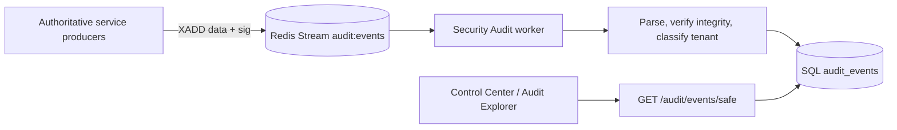

# OmniBioAI Security Audit

The Security Audit service provides security-event ingestion, verification,
durable persistence, and read-only query APIs. Redis Streams is the
ingestion/backlog transport; SQL `audit_events` is the durable query store.

## Purpose

The service provides a tamper-evident, tenant-aware audit trail for events
emitted by platform services such as the gateway, authentication, policy, TES,
workflow, and control-plane components. It is designed for asynchronous
ingestion, replayable delivery, durable storage, and safe administrative reads.

## Architecture



Redis is the stream and worker backlog, not query history. The worker persists
events idempotently by `event_id`; query services read SQL.

## Event lifecycle

1. A producer creates the event envelope, including authoritative tenant fields
   when available.
2. The producer publishes the exact JSON `data` string and optional `sig` to
   Redis Stream `audit:events`.
3. The worker parses the event, verifies the signature over the exact
   transmitted string, classifies integrity, and writes the durable row.
4. Read APIs query SQL. Filtering, counting, ordering, and pagination happen in
   SQL before the response is returned.

## Tenant model

`organization_id` is a first-class nullable event field and is covered by the
signed event payload. `tenant_scope` is one of:

| Value | Meaning |
|---|---|
| `organization` | An authoritative organization ID is present. |
| `global` | The producer explicitly declared a platform-wide event. |
| `unknown` | No authoritative tenant scope is available, including legacy rows. |

Null `organization_id` does not mean global. Organization callers can see only
rows with their verified organization ID and `tenant_scope=organization`.
GLOBAL and UNKNOWN rows are excluded from organization-scoped safe reads.

## Signing/integrity

The v1 HMAC-SHA256 signature is domain-separated and binds the producer
service, version, and exact Redis `data` string. The worker classifies each
row as `valid`, `invalid`, or `unsigned`; legacy and currently unsigned events
remain explicitly unverified evidence.

## Durable storage

Migration `0001_audit_events` created the SQL table and
`0002_integrity_status` added integrity classification. Migration
`0003_tenant_contract` added nullable `organization_id`, non-null
`tenant_scope` (default `unknown`), and the
`(organization_id, timestamp, event_id)` index. `event_id` is the primary key,
making worker redelivery safe and idempotent.

## Query APIs

| Endpoint | Method | Authorization | Description |
|---|---|---|---|
| `/health` | GET | None | Service health |
| `/audit/test` | GET | None today | Ingestion smoke test |
| `/audit/events` | GET | Verified `platform_admin` | Legacy/full platform query |
| `/audit/events/safe` | GET | Verified `manage_all_orgs` or `org_admin` with verified `org_id` | Tenant-safe query |

The legacy full query remains platform-wide. The safe API is the contract for
browser-facing or tenant-scoped consumption.

## Safe Query API

`GET /audit/events/safe` supports bounded pagination and filters for user,
service, event type, decision, timestamp range, integrity status, and (for a
platform-wide caller) organization ID. The effective caller scope is derived
from the verified token; a caller-supplied organization ID cannot widen it.

Platform-wide callers require `manage_all_orgs`. Organization callers require
`org_admin` plus a verified `org_id`; they cannot request another organization.
Tenant filtering occurs before SQL count, ordering, and pagination.

## Authorization model

The service verifies the bearer token, returns 401 for invalid or missing
identity, and returns 403 for a valid token without the required permission or
organization role/scope. The browser is never trusted to establish tenant
scope. The server derives effective scope from verified identity claims.

## Metadata/redaction

The safe response returns only the allowlisted metadata keys `trace_id`,
`request_id`, `workflow_id`, `run_id`, `resource_type`, `resource_id`, and
`backend`. Full context, credentials, tokens, and unbounded producer metadata
are not exposed by the safe projection.

## Source availability

The safe response reports durable-query evidence independently from ingestion
health:

| State | Meaning |
|---|---|
| `AVAILABLE` | The durable SQL query completed, including an empty result. |
| `UNAVAILABLE` | The durable query failed; the endpoint returns normalized 503 `AUDIT_SOURCE_UNAVAILABLE`. |
| `PARTIAL` | Reserved for an explicitly partial source contract; not inferred from missing evidence. |
| `UNKNOWN` | No authoritative availability evidence; not treated as healthy. |

## Freshness/retention semantics

The safe API currently reports `freshness=UNKNOWN`, `retention=UNKNOWN`, and
`ingestion_lag_seconds=null`. It does not claim CURRENT freshness, a retention
duration, or measured ingestion lag. Redis `AUDIT_MAXLEN` is a stream backlog
cap, not durable SQL retention. A successful SQL read is not evidence that all
producers are current.

## Migration state

The merged architecture is represented through Alembic revisions
`0001_audit_events` → `0002_integrity_status` → `0003_tenant_contract`.
Existing rows remain compatible: rows without authoritative tenant data are
`tenant_scope=unknown`, and rows without a signature are `unsigned`.

## Security properties

- Tenant scope is server-derived and signed tenant data is integrity-bound.
- Organization safe reads exclude GLOBAL and UNKNOWN events.
- SQL tenant filtering precedes count, order, and pagination.
- Safe metadata is allowlisted and integrity is normalized.
- Query access is read-only; no audit update or delete API exists.
- Durable query failure is surfaced safely as 503 without database details.
- Worker persistence is idempotent by event ID.

## Testing

The repository tests signing, integrity classification, event contracts, tenant
authorization and filtering, safe metadata, source semantics, migrations, SQL
persistence, stream processing, and worker recovery. Run:

```bash
pytest -q
```

## Current implementation status

SAT-1 and SAT-3/SAT-4 are merged in the current main architecture: the tenant
contract and durable SQL persistence are implemented; tenant-safe query,
verified authorization, normalized integrity, safe metadata, source evidence,
and conservative freshness/retention semantics are implemented. SAT-2
producer propagation is closed for the confirmed producer set described below.

## Known limitations

- Legacy events remain UNKNOWN tenant scope and unsigned integrity evidence.
- The safe API does not establish durable retention or freshness duration.
- Source availability describes the SQL query, not complete ecosystem ingestion.
- Producer coverage and live evidence vary by service and deployment; TES and
  Workflow Bundles have fixture-limited live evidence.
- Additional sinks, alerting, and operational retention policy are outside
  this merged query contract.

## SAT-2 producer rollout status

SAT-2 propagation is complete for the confirmed Security Audit producers:
Gateway, RAG, LIMS, TES, and Workflow Bundles. Gateway, RAG, and LIMS have
live durable evidence; TES and Workflow Bundles are code/test complete but
their available live operations did not produce a harmless audited fixture.

Model Registry is not a confirmed Security Audit producer and is out of scope
until an approved stream path exists. The generic Security SDK is not adopted
by the discovered producers; SDK adoption remains future work. No SAT-2
producer was added for GLOBAL events, so GLOBAL visibility must not be inferred
from the current evidence.
